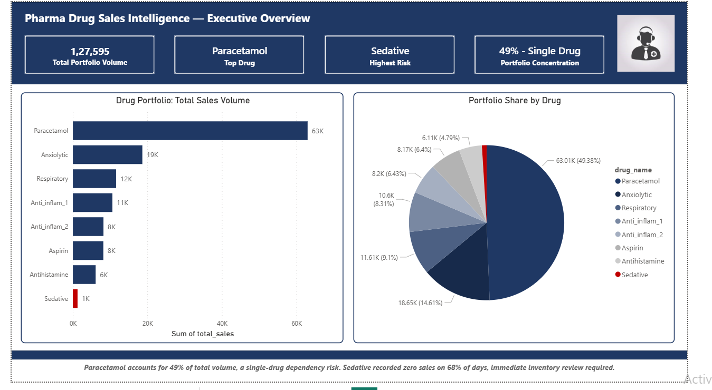
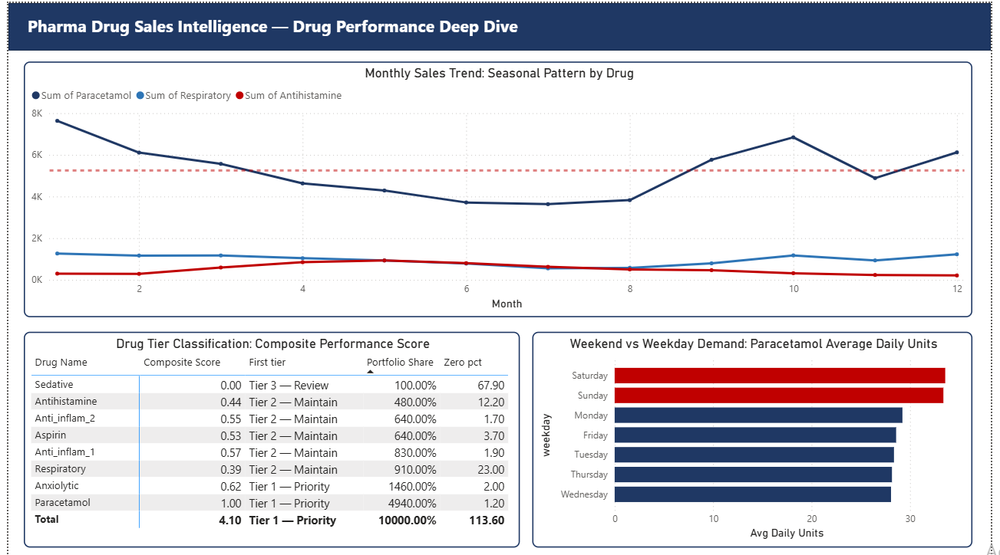
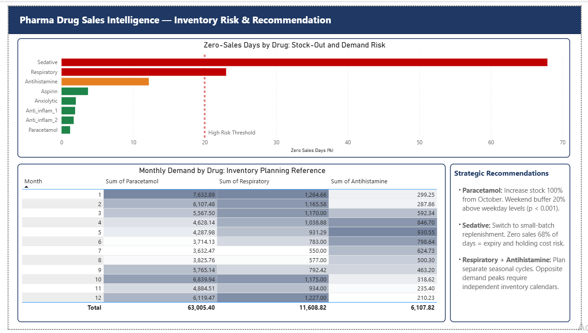

# Pharma Drug Sales Analytics
### End-to-End Demand Intelligence Pipeline | SQL + Python + Power BI

   

---

## Overview

End-to-end analytics pipeline on 6 years of retail pharmacy daily sales data (2014-2019) across 8 drug categories. Built to mirror a real pharma consulting engagement: identify demand patterns, flag inventory risks, and deliver actionable business recommendations.

**Business Question:** Where should a pharmacy focus inventory investment and sales strategy to maximise revenue and minimise stock-out risk?

---

## Key Findings

- Paracetamol accounts for **49.4% of total portfolio volume** creating a single-drug dependency risk
- Sedative recorded **zero sales on 67.9% of days** indicating a critical stocking or positioning failure
- Weekend Paracetamol demand is **18% higher than weekdays**, statistically confirmed (p < 0.001)
- Respiratory and Antihistamine follow **opposite seasonal cycles** requiring independent inventory strategies
- **2x seasonal demand swing** identified for Paracetamol between peak winter months and summer trough

---

## Tools

| Tool | Purpose |
|------|---------|
| Python (pandas, numpy, scipy, seaborn) | Data cleaning, EDA, statistical testing |
| SQL (SQLite) | Business queries, aggregation, seasonal analysis |
| Power BI | 3-page executive dashboard |

---

## Dashboard Preview

### Page 1: Executive Overview

### Page 2: Drug Performance Deep Dive

### Page 3: Inventory Risk and Recommendations

---

## Analysis

### SQL Business Intelligence
8 business queries covering portfolio revenue ranking, monthly seasonality, day-of-week performance, year-over-year trend, high demand day identification, portfolio mix percentage, seasonal segmentation, and zero-sales day risk assessment.

### Python EDA and Statistical Analysis
Data quality checks, portfolio mix visualisation, seasonality line charts, weekday demand heatmap, year-over-year trends, sales distribution box plots, t-test validation, correlation matrix, and zero-sales frequency analysis across all 8 drug categories.

### Composite Performance Scoring Model

Each drug scored across 3 dimensions with client-validated weights:

| Dimension | Weight | Rationale |
|-----------|--------|-----------|
| Volume Score | 50% | Primary revenue driver |
| Reliability Score | 30% | Operational consistency |
| Stability Score | 20% | Demand predictability |

**Tier Classification Results:**

| Drug | Composite Score | Tier |
|------|----------------|------|
| Paracetamol | 1.000 | Tier 1: Priority |
| Anxiolytic | 0.620 | Tier 1: Priority |
| Anti-Inflam 1 | 0.569 | Tier 2: Maintain |
| Anti-Inflam 2 | 0.550 | Tier 2: Maintain |
| Aspirin | 0.531 | Tier 2: Maintain |
| Antihistamine | 0.443 | Tier 2: Maintain |
| Respiratory | 0.388 | Tier 2: Maintain |
| Sedative | 0.000 | Tier 3: Review |

### Statistical Validation

Weekend vs Weekday Paracetamol Demand:

| Metric | Value |
|--------|-------|
| Weekend mean | 33.49 units per day |
| Weekday mean | 28.49 units per day |
| t-statistic | 6.716 |
| p-value | < 0.001 |
| Result | Weekend demand statistically significantly higher at 95% confidence |

---

## Strategic Recommendations

**1. Paracetamol: Inventory Priority**
Increase safety stock 100% entering October. Maintain weekend buffer 20% above weekday levels. Single-drug dependency at 49% portfolio share requires supplier diversification strategy.

**2. Sedative: Immediate Review Required**
Zero sales on 67.9% of days warrants urgent investigation. Switch to small-batch replenishment to eliminate expiry waste and holding costs.

**3. Respiratory and Antihistamine: Separate Seasonal Cycles**
Respiratory peaks in winter (December index 1.47), Antihistamine peaks in spring (April index 1.67). These drugs require fully independent inventory calendars.

---

## Dataset

**Source:** Pharmaceutical Sales Data (Kaggle, publicly available)  
**Coverage:** January 2014 to October 2019  
**Volume:** 2,106 daily sales records across 8 ATC-classified drug categories

---

*Prachi | MBA Business Analytics | Delhi Technological University*# pharma-salesforce-analytics
